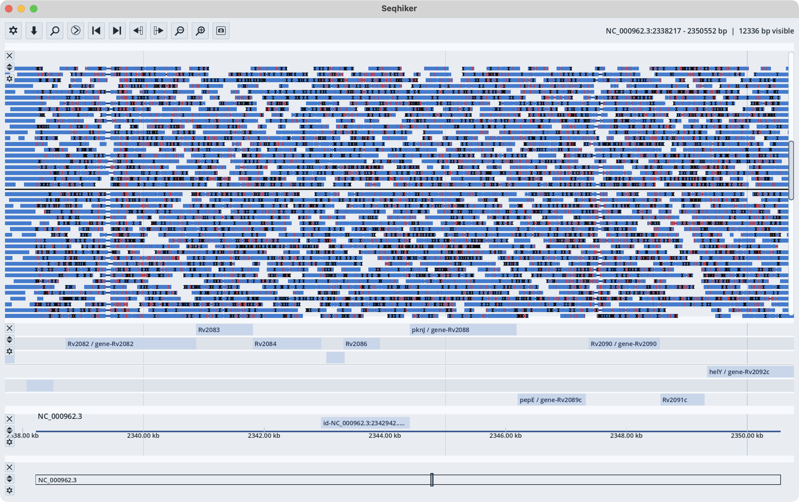
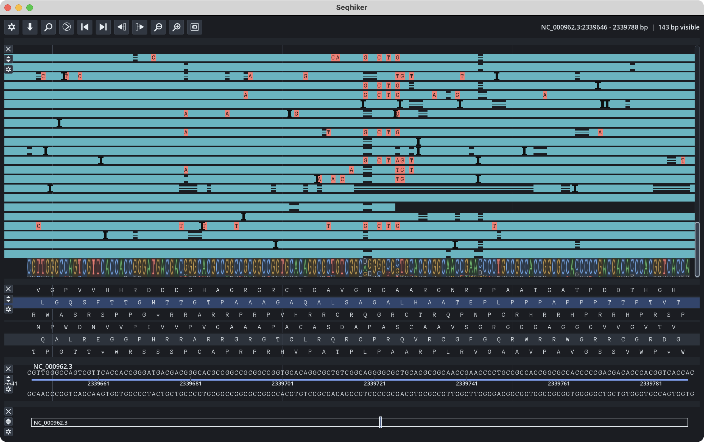
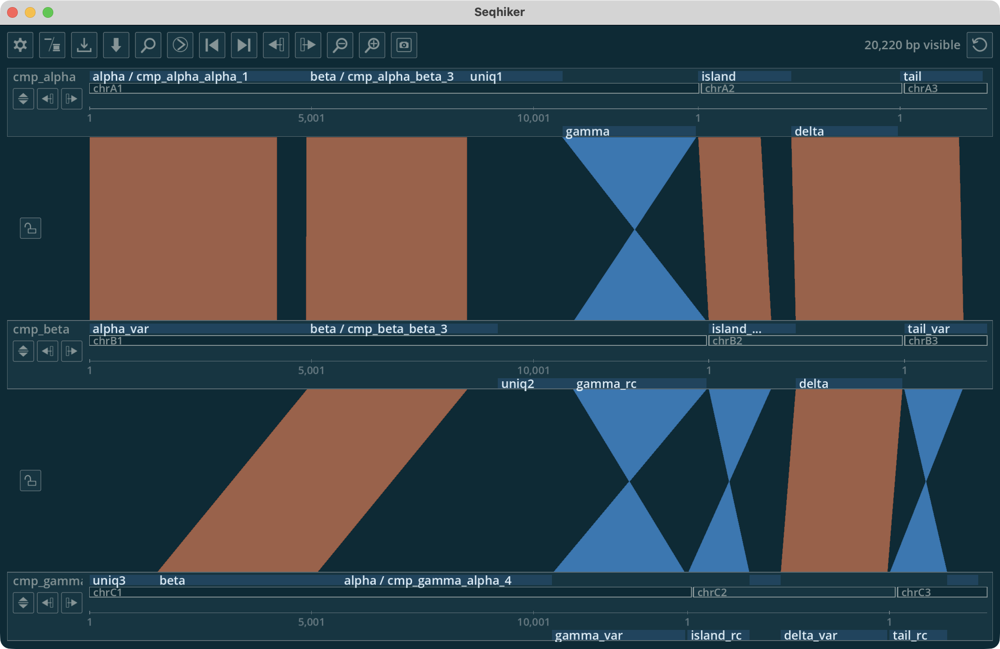
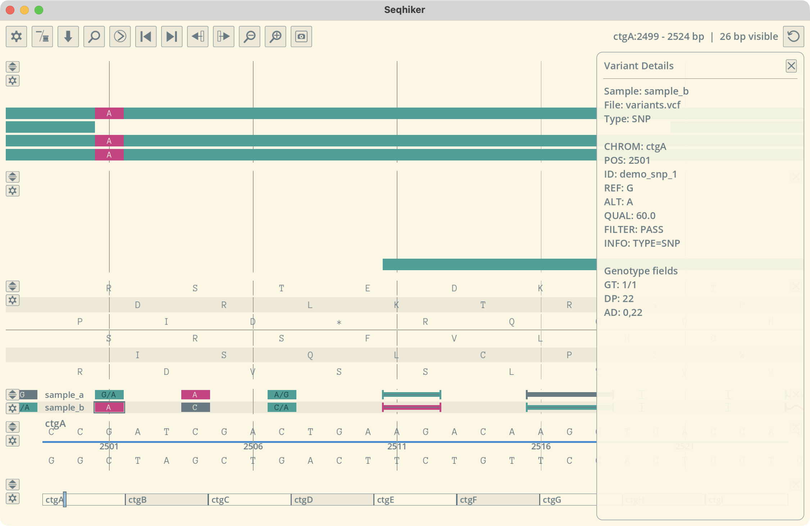

# The Seqhiker's Guide

`seqhiker` is an interactive genome browser for viewing reference sequence, annotations, BAM alignments, VCF variants, and whole-genome comparison layouts.

This documentation is a quick user guide. Start here if you want to install the app, open your files, and begin exploring a genome.

```{raw} html
<table>
  <tr>
    <td width="50%">
      <a href="_static/seqhiker_screenshot_1.png">
        
      </a>
    </td>
    <td width="50%">
      <a href="_static/seqhiker_screenshot_2.png">
        
      </a>
    </td>
  </tr>
  <tr>
    <td width="50%">
      <a href="_static/seqhiker_screenshot_3.png">
        
      </a>
    </td>
    <td width="50%">
      <a href="_static/seqhiker_screenshot_4.png">
        
      </a>
    </td>
  </tr>
</table>
```

## Quick start

1. Install the latest release.
2. Open `seqhiker`.
3. Drag and drop your files into the window.

A sequence file must be included. This can be:

- FASTA
- GenBank
- EMBL

You can then add:

- GFF3 annotations
- BAM files
- VCF files

You can also switch to `Comparison view` and add genomes one-by-one to compare them.

For more detail, see:

```{toctree}
:maxdepth: 2
:caption: Contents

install
supported-files
navigation
contig-actions
theme-editor
comparison-view
genome-and-annotation-tracks
reads-track
vcf-track
```
